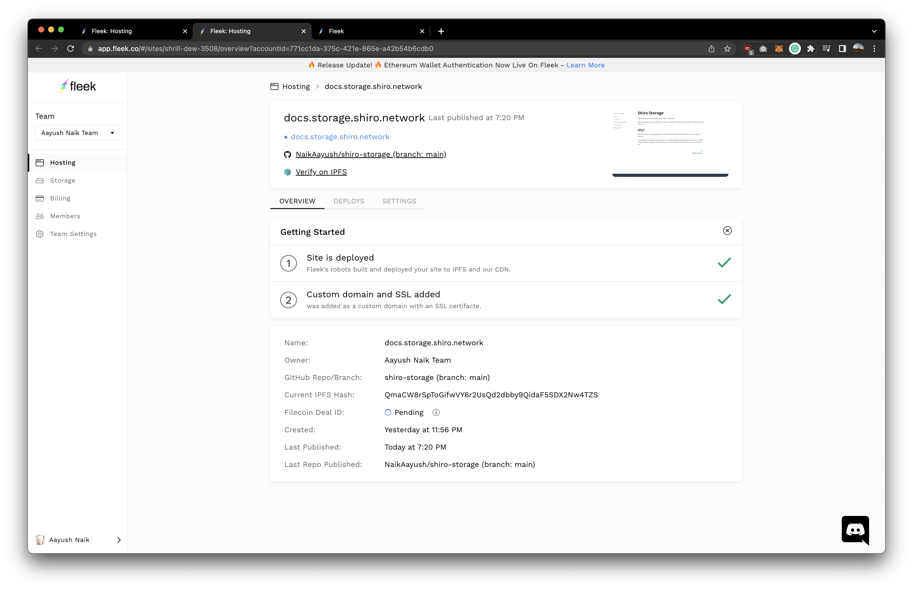

# Website

This website is built using [Docusaurus 2](https://docusaurus.io/), a modern static website generator.

### Installation

```
$ npm install
```

### Local Development

```
$ npm start
```

This command starts a local development server and opens up a browser window. Most changes are reflected live without having to restart the server.

### Deployment

The documentation website is currently deployed using [Fleek](https://fleek.co/)


